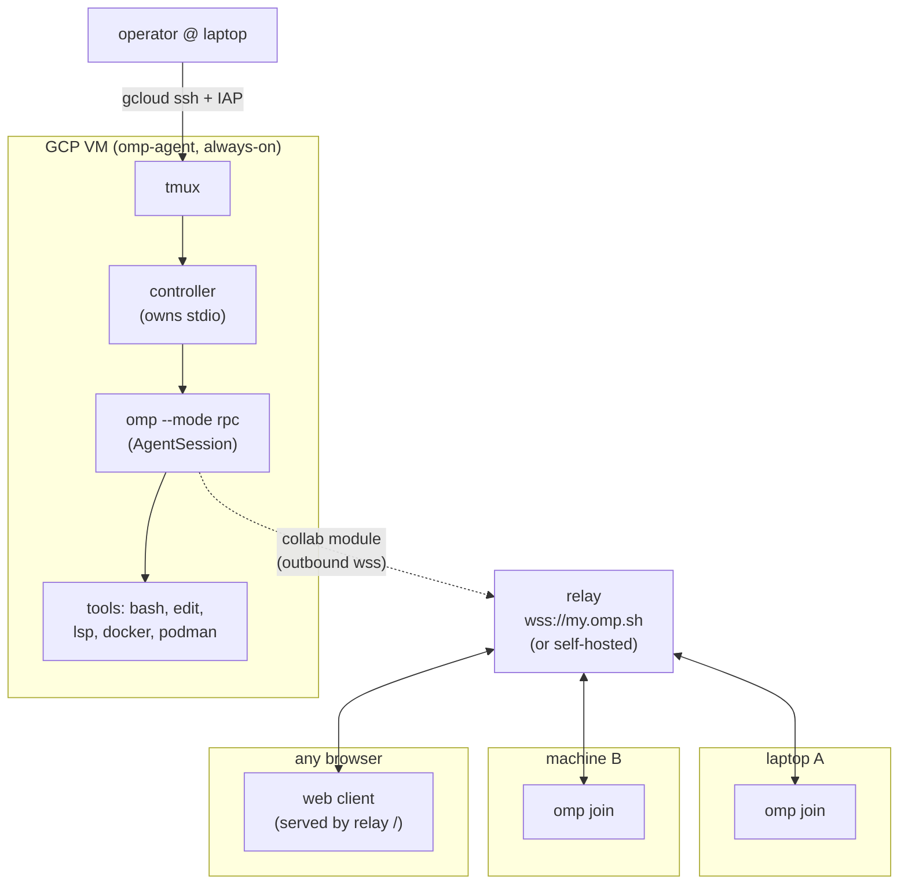
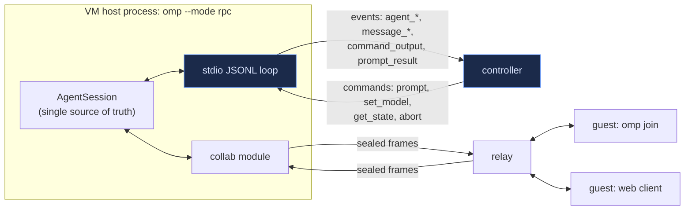
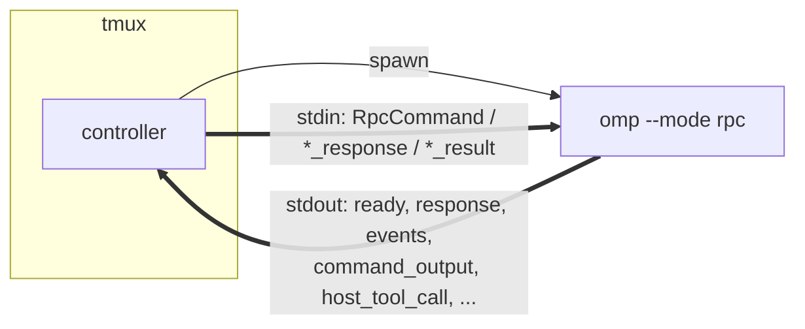
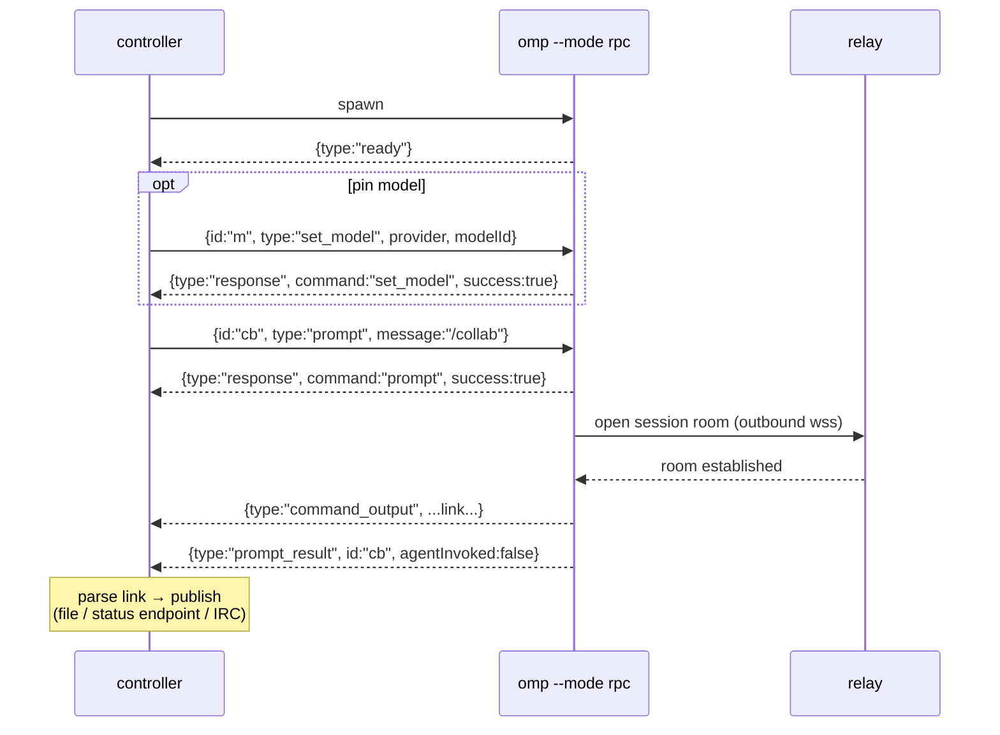
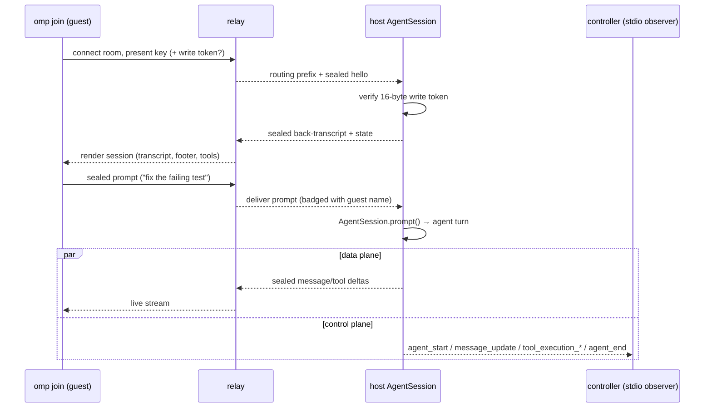
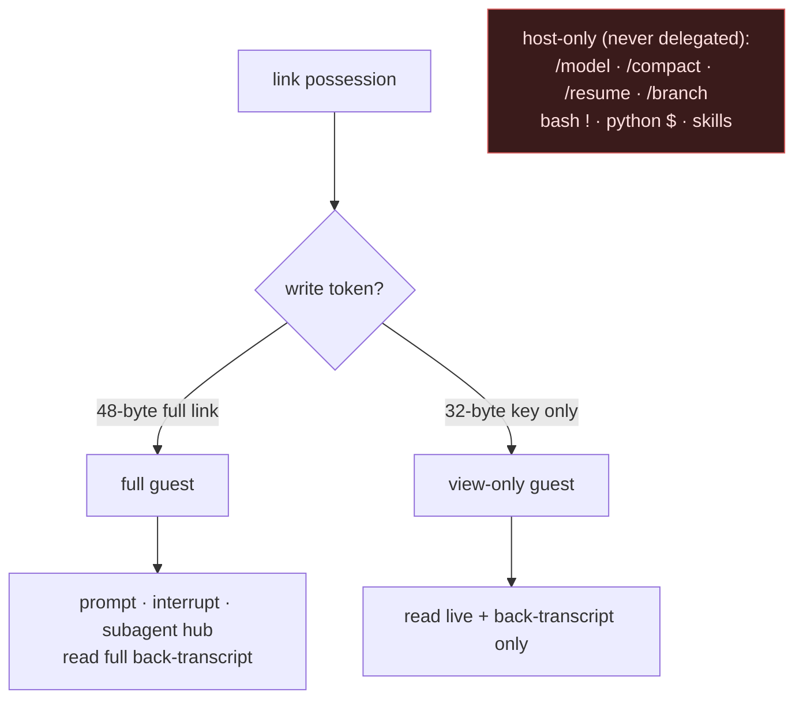
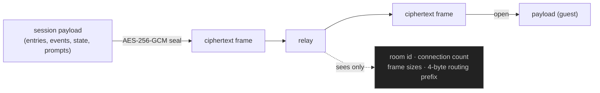
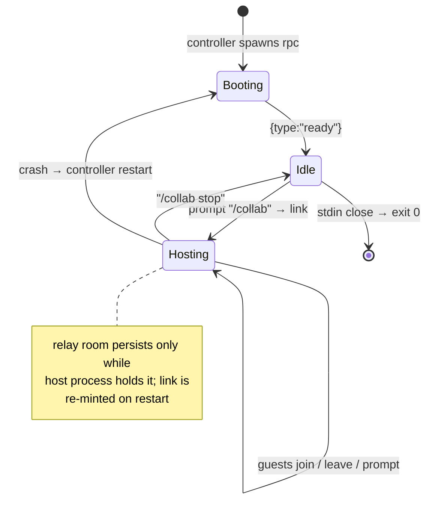

# Shared Remote Agent Machine — Architecture

A single always-on GCP VM hosts one omp agent session as a **headless RPC
server**. The session is fanned out to many user machines via **collab** over an
E2E-encrypted relay. RPC is the control plane (lifecycle, automation); collab is
the data plane (human participants).

Sources: `omp://rpc.md`, <https://omp.sh/docs/collab>.

---

## 1. Goals / non-goals

| Goal | Mechanism |
| --- | --- |
| One long-lived agent session, survives laptop sleep | RPC server under tmux on VM |
| Many users, many machines, live shared view + steering | collab `/collab` → `omp join` |
| Programmatic lifecycle (start, model, re-share, health) | RPC JSONL over stdio |
| Zero inbound ports on the VM | host + guests dial the relay outbound |
| Repo, toolchain, docker/podman centralized | all tools execute host-side on VM |

Non-goals: multi-session multiplexing (one session per server process),
guest-side tool execution (always host-side), relay-side plaintext (never).

---

## 2. Topology

Key property: the VM and every guest **dial out** to the relay. No inbound
firewall rule on the VM is required for sharing; SSH control rides IAP.

---

## 3. Components

| Component | Role | Transport |
| --- | --- | --- |
| `omp --mode rpc` | The agent host. Owns the single `AgentSession`; runs all tools. | JSONL over stdio |
| controller | Supervises the RPC child: bootstraps collab, parses the link, watches events, re-shares, exposes health. | spawns child; reads/writes stdio |
| tmux | Keeps controller+child alive across SSH disconnects. | — |
| collab module (in-process) | Seals session frames (AES-256-GCM), multiplexes guests, dials the relay. | outbound wss |
| relay | Blind rendezvous. Routes opaque ciphertext between host and guests; serves the browser client at `/`. | wss |
| `omp join` / web client | Guests. Render the session natively; prompt/interrupt if write-capable. | wss to relay |
| operator SSH | Out-of-band lifecycle (start server, attach tmux, inspect). | ssh via IAP |

---

## 4. Two planes, one session

The crux: **control plane (RPC/stdio)** and **data plane (collab/relay)** both
act on the *same in-process `AgentSession`*. RPC drives it locally and
programmatically; collab projects it to remote humans.

- **Control plane** (stdio): the controller issues `RpcCommand`s and consumes
  `AgentSessionEvent`s. This is how `/collab` is started headlessly and how the
  server is steered/monitored without a human at the TUI.
- **Data plane** (relay): collab serializes session entries/events/state/prompts,
  seals each payload, and exchanges them with guests through the relay.

Guest prompts enter the same `AgentSession` the controller sees; the controller
observes guest-originated turns as ordinary `agent_start`/`message_*`/`agent_end`
events on stdio.

---

## 5. RPC server: process & framing

Framing (from `omp://rpc.md`): one JSON object per line.

- Startup emits `{ "type": "ready" }` before accepting commands.
- `@file` args rejected in RPC mode; auto-title suppressed; workflow settings
  (`todo.*`, `task.*`, `memory.*`, `advisor.*`, `async.*`, `bash.autoBackground.*`)
  reset to built-in defaults.
- Stdin close → pending host-tool / host-URI calls rejected → exit 0.
- `prompt` / `abort_and_prompt` are **acked on acceptance, not completion**.
  Agent turns complete via `agent_end`; local-only slash commands complete via
  `data.agentInvoked: false` or a later `prompt_result`, after emitting
  `command_output` frames.

Inbound (stdin) | Outbound (stdout)
--- | ---
`RpcCommand` | `ready`, `response`
`extension_ui_response` | `AgentSessionEvent` (`agent_*`, `turn_*`, `message_*`, `tool_execution_*`)
`host_tool_update` / `host_tool_result` | `extension_ui_request`
`host_uri_result` | `host_tool_call` / `host_tool_cancel`
| `host_uri_request` / `host_uri_cancel`
| `command_output`, `session_info_update`, `config_update`
| `available_commands_update`, `prompt_result`
| `subagent_lifecycle` / `subagent_progress` / `subagent_event`

---

## 6. Collab bootstrap (headless)

The controller starts sharing by sending `/collab` as a `prompt` frame, then
scrapes the join link from `command_output`.

The link (`<roomId>#<key>`) is the only secret a guest needs. The controller
persists it (e.g. `~/collab.link` on the VM, or prints it) for retrieval via
`manage.sh`/`session.sh`. `/collab view` yields a read-only variant.

---

## 7. Guest join + prompt round trip

Names are display-only; the LLM sees prompt text verbatim. A guest's `Esc`
interrupt rides the same sealed channel and maps to the host's abort path.

---

## 8. Trust & permission layering

Enforcement is by the link itself: the host verifies the write token at join and
rejects writes from tokenless peers (they show read-only in the participants
list). Guests keep a small local allowlist (`/dump`, `/export`, `/copy`,
`/help`, `/hotkeys`, `/theme`, `/settings`, `/leave`, `/collab`, `/exit`).

---

## 9. Encryption & what the relay sees

The key lives in the URL fragment (`#<key>`), never sent in any HTTP request,
never reaching the relay. Possession of the link is the entire trust boundary —
treat full and view-only links as secrets.

---

## 10. Network & auth matrix

| Path | Direction | Port/Proto | Auth |
| --- | --- | --- | --- |
| operator → VM (control) | outbound from laptop | 443 → IAP → 22 | Google IAM (OS Login + `iap.tunnelResourceAccessor`) |
| VM host → relay (data) | outbound from VM | 443 wss | room key (E2E); relay blind |
| guest → relay (data) | outbound from guest | 443 wss | link (key ± write token) |
| browser → relay (client) | outbound | 443 https + wss | link in fragment |

No inbound ports open on the VM for collab. The legacy 7077 firewall rule from
the earlier container design is unused and removed on `manage.sh destroy`.

---

## 11. Session lifecycle

A host restart mints a new room/link (re-published by the controller). Guests
reconnect with the new link; their prior local session is restored on `/leave`.

---

## 12. Failure modes

| Failure | Detection | Recovery |
| --- | --- | --- |
| rpc child crash | controller sees stdout EOF | respawn, re-`/collab`, re-publish link |
| relay unreachable | collab connect error event | retry with backoff; link stable across retries |
| VM stop/restart | tmux + controller gone | `manage.sh start` → controller re-bootstraps |
| guest write without token | host token verify fails | guest downgraded to read-only |
| turn streaming at guest join | v1 limit | guest sees it from next message boundary |
| stdin parse error | `command:"parse"` response | loop continues; controller logs and proceeds |

---

## 13. Implementation sketch

Controller responsibilities (single small process, runs in tmux on the VM):

1. `spawn("omp", ["--mode","rpc", ...launchOpts])`; wait for `ready`.
2. Optional `set_model`, `set_thinking_level`, pre-seed `set_todos`.
3. `prompt "/collab"` (or `"/collab view"`); read `command_output`, extract link.
4. Publish link: write `local://collab.link` equivalent on VM + log; expose via
   `session.sh collab` from the operator laptop.
5. Subscribe to events for health/observability (`agent_*`, `subagent_*`).
6. Supervise: on child exit, respawn and re-bootstrap.
7. (Optional) accept operator commands (re-share, rotate to view-only, status)
   over a local unix socket.

Operator surface (extends existing scripts):

| Command | Action |
| --- | --- |
| `manage.sh start` | start the VM |
| `session.sh serve` | start controller+rpc under tmux (idempotent) |
| `session.sh collab [view]` | print current join link (re-share if needed) |
| `session.sh status` | participants + host state via controller |
| `omp join "<link>"` | from any user machine |

Minimal alternative (no controller): run `omp` interactively under tmux and type
`/collab` by hand. Loses programmatic lifecycle and headless restart; use only
for a quick trial.

---

## 14. Why this shape

- **RPC server, not interactive TUI on the host**: headless, scriptable
  lifecycle (start/restart/model/health) without a human attached; the session
  outlives any terminal.
- **collab for users, not SSH-shared tmux**: guests get a native rendered
  session (tool cards, subagent hub, footer state) and per-link permissions,
  not a raw mirrored terminal; works from a browser with nothing installed.
- **relay dial-out both sides**: no inbound exposure on the VM; the relay is a
  blind ciphertext router, so the trust boundary collapses to link possession.
