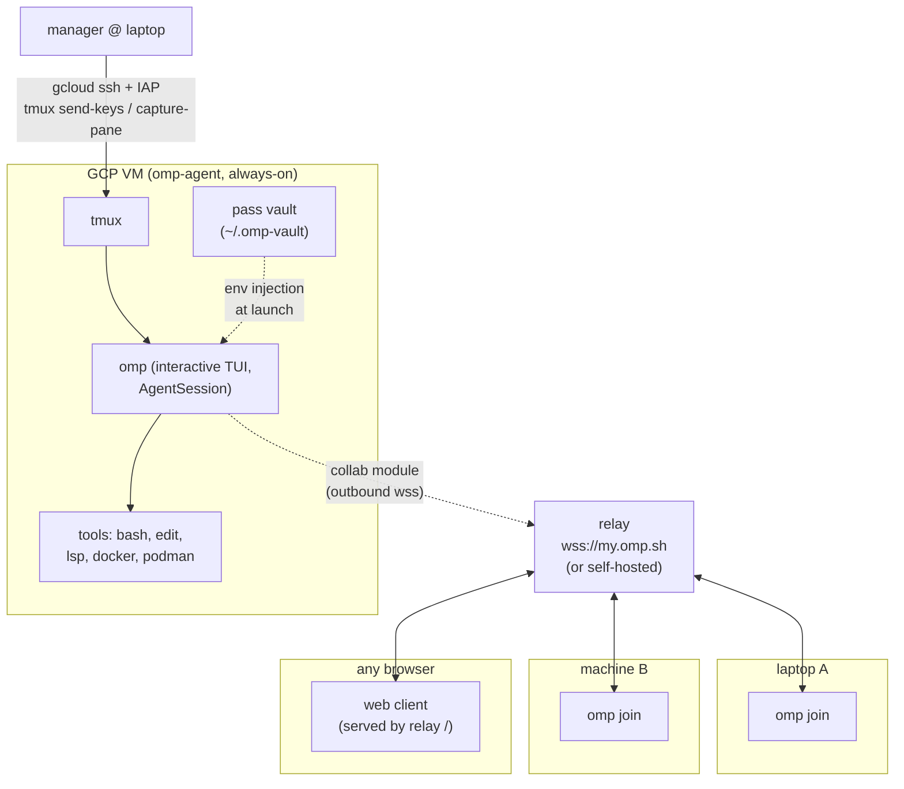
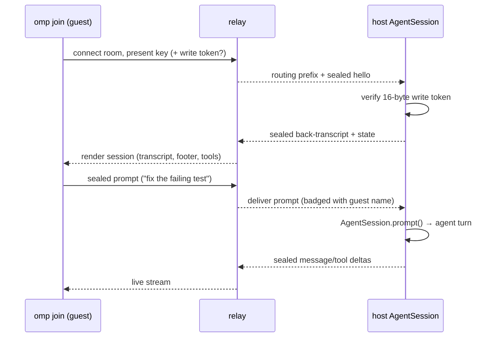
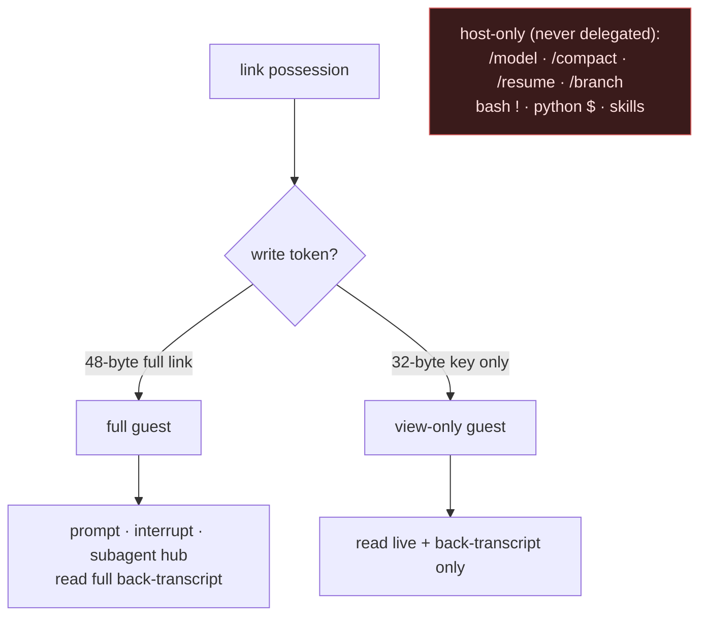
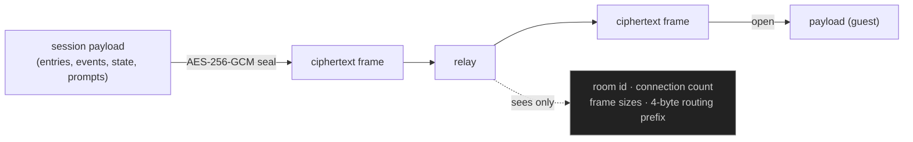
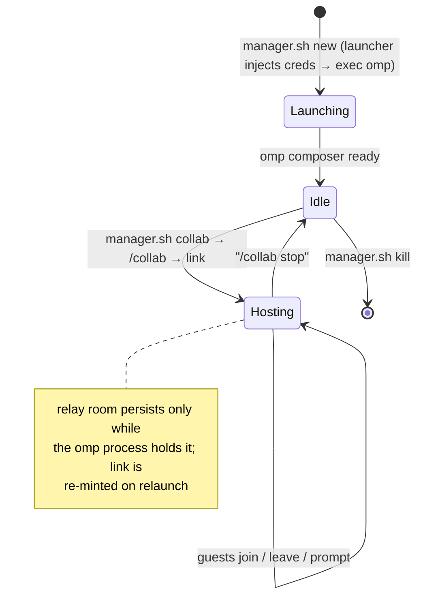

# Shared Remote Agent Machine — Architecture

A single always-on GCP VM hosts an **interactive omp agent session under tmux**. The
session is fanned out to many user machines via **collab** over an E2E-encrypted relay.
The **manager** drives session lifecycle and `/collab` over `gcloud ssh` (`tmux
send-keys` / `capture-pane`); guests join the same live session from any machine.

Sources: <https://omp.sh/docs/collab>.

---

## 1. Goals / non-goals

| Goal | Mechanism |
| --- | --- |
| One long-lived agent session, survives laptop sleep | interactive omp under tmux on the VM |
| Many users, many machines, live shared view + steering | collab `/collab` → `omp join` |
| Per-session credentials, hidden from the model | vault → env injection + `secrets.enabled` |
| Zero inbound ports on the VM | host + guests dial the relay outbound |
| Repo, toolchain, docker/podman centralized | all tools execute host-side on the VM |

Non-goals: guest-side tool execution (always host-side), relay-side plaintext (never),
a headless programmatic-control protocol (the manager drives the interactive TUI under tmux instead).

---

## 2. Roles

| Role | Surface | Owns |
| --- | --- | --- |
| **Administrator** | `administrator.sh` | GCP/VM lifecycle: provision, start/stop, bootstrap (OS packages + mise/bun/omp), ssh, destroy. |
| **Manager** | `manager.sh` | VM-wide omp platform config (global `secrets.enabled`, global skills + `RULES.md`/`AGENTS.md` + `secrets.yml`, the `pass` vault) **and** per-session lifecycle (create with seeded `.omp/` + injected creds, attach/list/kill, share collab link). |
| **Operator / joiner** | *(no script)* | Interacts only by `omp join`-ing the shared session. Behaviour is governed by the global `RULES.md`/`AGENTS.md` and skills the manager installs. |

---

## 3. Topology

Key property: the VM and every guest **dial out** to the relay. No inbound firewall
rule on the VM is required for sharing; manager control rides IAP.

---

## 4. Components

| Component | Role | Transport |
| --- | --- | --- |
| `omp` (interactive) | The agent host. Owns the single `AgentSession`; runs all tools. | TUI inside tmux |
| tmux | Keeps the session alive across SSH disconnects; the manager drives it via `send-keys`/`capture-pane`. | — |
| `pass` vault | At-rest, GPG-encrypted credential store on the VM. A per-session launcher decrypts the configured subtree and exports it as env vars before `exec omp`. | local fs |
| collab module (in-process) | Seals session frames (AES-256-GCM), multiplexes guests, dials the relay. | outbound wss |
| relay | Blind rendezvous. Routes opaque ciphertext between host and guests; serves the browser client at `/`. | wss |
| `omp join` / web client | Guests. Render the session natively; prompt/interrupt if write-capable. | wss to relay |
| manager SSH | Out-of-band lifecycle + `/collab` driving (`gcloud ssh` + IAP). | ssh via IAP |

---

## 5. Credentials

Design (selected POC, "Approach A"): **env injection from a `pass` vault + global
`secrets.enabled` obfuscation.**

- The manager keeps a no-passphrase ed25519 `pass` vault at `~/.omp-vault` on the VM.
  Entries live under a subtree (default `services`), e.g. `services/github/token`.
- `manager.sh new` generates a per-session launcher that decrypts the whole subtree
  and exports each entry as an env var, then `exec omp`. The entry path maps to the
  var name (`/` and `-` → `_`, uppercased), so `services/github/token` → `GITHUB_TOKEN`
  — which matches omp's `TOKEN` secret-name pattern. The launcher contains only
  `pass show` commands, never values.
- Global `secrets.enabled: true` replaces matched env-var values with `#XXXX#`
  placeholders before any outbound text reaches the model. `~/.omp/agent/secrets.yml`
  holds value-shape regex backstops for vars whose name lacks a secret keyword.

POC findings (verbatim — these define the trust boundary):

- **M = PASS** — the model only ever receives the `#XXXX#` placeholder, never the real
  value.
- **G = guest EXPOSED** — a joined guest sees the real value on the final
  de-obfuscated render and in any tool card. **Joiners are inside the credential trust
  boundary.** Hiding credentials from guests requires Tier-2 OS isolation (see
  `TODO-per-session-credentials.md`).
- **R = conditional FAIL** — omp persists `toolResult` blocks de-obfuscated into the
  session `.jsonl`, so a secret leaks to disk **only if a tool prints it**. Operational
  rule (enforced by `RULES.md`): never echo/print/log a credential; consume it inline.

The no-passphrase vault is the documented **Tier-1** boundary: any in-session
participant can decrypt. Tier-2 (per-session OS isolation) is the fix and is tracked,
not built.

---

## 6. Guest join + prompt round trip

Names are display-only; the LLM sees prompt text verbatim. A guest's `Esc` interrupt
rides the same sealed channel and maps to the host's abort path.

---

## 7. Trust & permission layering

Enforcement is by the link itself: the host verifies the write token at join and
rejects writes from tokenless peers (they show read-only in the participants list).
Guests keep a small local allowlist (`/dump`, `/export`, `/copy`, `/help`, `/hotkeys`,
`/theme`, `/settings`, `/leave`, `/collab`, `/exit`).

---

## 8. Encryption & what the relay sees

The key lives in the URL fragment (`#<key>`), never sent in any HTTP request, never
reaching the relay. Possession of the link is the entire trust boundary — treat full
and view-only links as secrets.

---

## 9. Network & auth matrix

| Path | Direction | Port/Proto | Auth |
| --- | --- | --- | --- |
| manager → VM (control) | outbound from laptop | 443 → IAP → 22 | Google IAM (OS Login + `iap.tunnelResourceAccessor`) |
| VM host → relay (data) | outbound from VM | 443 wss | room key (E2E); relay blind |
| guest → relay (data) | outbound from guest | 443 wss | link (key ± write token) |
| browser → relay (client) | outbound | 443 https + wss | link in fragment |

No inbound ports open on the VM for collab. The legacy 7077 firewall rule from the
earlier container design is unused and removed on `administrator.sh destroy`.

---

## 10. Session lifecycle

A relaunch mints a new room/link (re-shared via `manager.sh collab`). Guests reconnect
with the new link; their prior local session is restored on `/leave`.

---

## 11. Failure modes

| Failure | Detection | Recovery |
| --- | --- | --- |
| relay unreachable | collab connect error event | retry with backoff; link stable across retries |
| VM stop/restart | tmux gone | `administrator.sh start` → `manager.sh new` |
| guest write without token | host token verify fails | guest downgraded to read-only |
| turn streaming at guest join | v1 limit | guest sees it from next message boundary |
| credential printed by a tool | value lands in `.jsonl` / on guest screens | `RULES.md` forbids printing; rotate the leaked entry |

---

## 12. Operator surface

| Command | Action |
| --- | --- |
| `administrator.sh start` | start the VM |
| `manager.sh setup` | enable `secrets.enabled`, ensure the vault, install global assets |
| `manager.sh vault-add ENTRY` | insert a credential (value on stdin, never echoed) |
| `manager.sh new NAME [--subtree SUB]` | launch a session with seeded `.omp/` + injected creds |
| `manager.sh collab [NAME] [view]` | print the current join link (re-share if needed) |
| `manager.sh attach [NAME]` | attach to a session (most recent if NAME omitted) |
| `omp join "<link>"` | from any user machine |

---

## 13. Why this shape

- **Interactive omp under tmux, driven by the manager**: the session outlives any
  terminal and survives laptop sleep; the manager steers lifecycle and `/collab`
  out-of-band over IAP without a human pinned to the TUI.
- **collab for users, not SSH-shared tmux**: guests get a native rendered session
  (tool cards, subagent hub, footer state) and per-link permissions, not a raw mirrored
  terminal; works from a browser with nothing installed.
- **relay dial-out both sides**: no inbound exposure on the VM; the relay is a blind
  ciphertext router, so the trust boundary collapses to link possession.
- **vault + obfuscation for credentials**: secrets stay off the model (M=PASS) and at
  rest in GPG ciphertext; the residual exposure to in-session guests (G) and to a
  printing tool (R) is documented and bounded by `RULES.md` + the Tier-2 roadmap.
