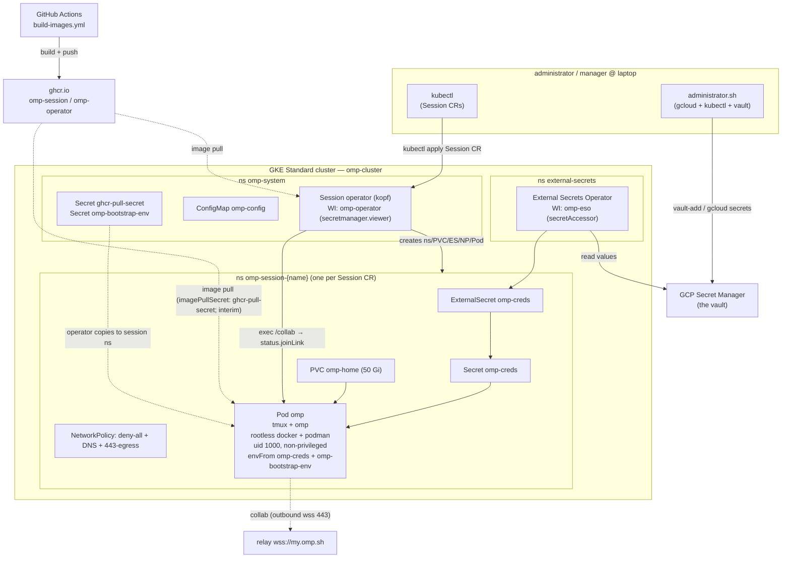
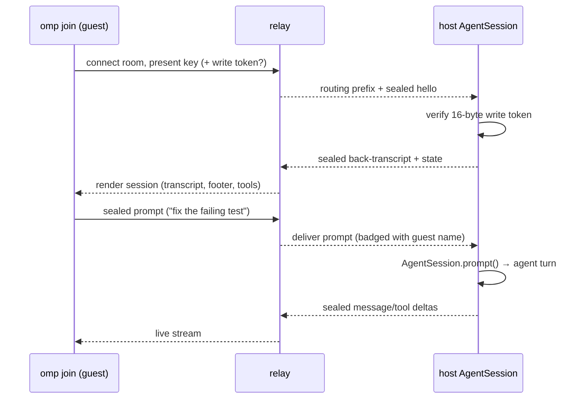
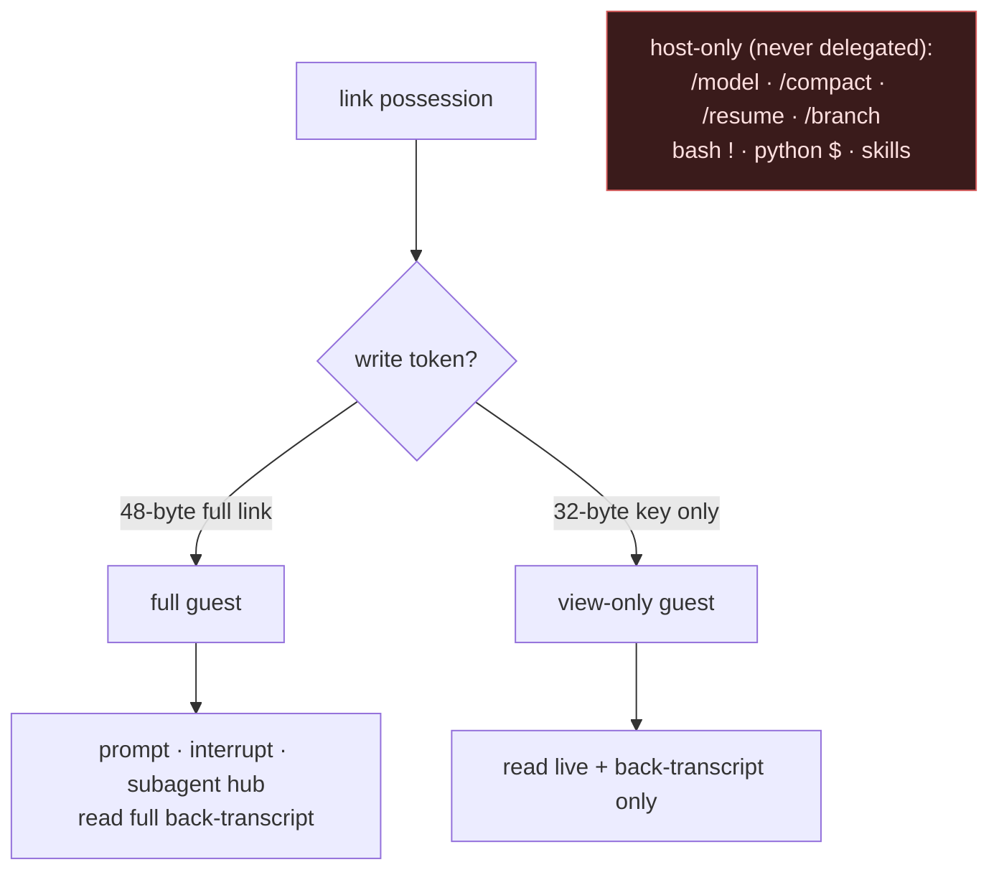
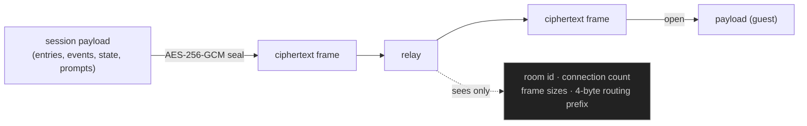

# Shared Remote Agent Machine — Architecture (GKE)

Each `omp` agent session runs as an **isolated pod in its own Kubernetes namespace**,
provisioned by a custom `Session` CRD operator on a GKE Standard cluster. Sessions
share the same relay and collab trust model as before; isolation, credentials, and
lifecycle are fully Kubernetes-native.

Sources: <https://omp.sh/docs/collab>.

---

## 1. Goals / non-goals

| Goal | Mechanism |
| --- | --- |
| Per-session credential isolation (realized) | Each session namespace owns its own K8s Secret synced from GSM by ESO; no cross-namespace access |
| Many independent, simultaneously joinable sessions | One `Session` CR per session; operator provisions a pod + link per CR |
| Credentials hidden from the model | GSM → ESO → K8s Secret → pod env + global `secrets.enabled` obfuscation |
| Zero inbound ports | Session pod + guests dial relay outbound only; NetworkPolicy denies all ingress |
| Session state / OAuth tokens persist across pod restarts | PVC `omp-home` (50 Gi) per session; `$HOME` survives restart; deleted on CR delete |
| Repo, toolchain, docker/podman centralized | All tools execute inside the session pod |

Non-goals: guest-side tool execution (always pod-side), relay-side plaintext (never),
multi-tenant cluster access (single admin account).

---

## 2. Roles

| Role | Surface | Owns |
| --- | --- | --- |
| **Administrator** | `administrator.sh` | GKE cluster lifecycle (provision, bootstrap, credentials, status, destroy); platform setup (`setup`, `tune`); credential vault (`vault-add`, `vault-ls`). |
| **Manager** | `administrator.sh` + `kubectl` | Session lifecycle via `kubectl` (apply/delete/exec Session CRs); vault and platform config via `administrator.sh`. |
| **Operator / joiner** | *(no script)* | Interacts only by `omp join`-ing the shared session. Behaviour governed by `RULES.md`/`AGENTS.md` and skills baked into the image. |

---

## 3. Topology

Key property: the session pod and every guest **dial out** to the relay. No inbound
firewall rule or inbound NetworkPolicy rule is needed. Manager control rides
`kubectl exec` over the K8s API — no IAP/SSH.

---

## 4. Components

| Component | Role | Transport |
| --- | --- | --- |
| `Session` CRD (`omp.mirantis.io/v1alpha1`) | Declarative session descriptor; one CR per session. `spec` carries `subtrees`, `view`, `image`, `env` (map). Status carries `phase`, `namespace`, `podName`, `joinLink`, `viewLink`. | etcd / K8s API |
| Session operator (kopf/Python) | Reconciles `Session` CRs: creates namespace, PVC, ExternalSecret, NetworkPolicy, Pod; captures collab link via `pods/exec`; GCs namespace on CR delete. | in-cluster API + pod exec |
| External Secrets Operator (ESO) | Syncs GSM secret values into per-namespace K8s Secrets via `ClusterSecretStore omp-gsm` (Workload Identity). Refreshes hourly. | GSM API → K8s Secret API |
| GCP Secret Manager | At-rest credential store. Entries labelled `omp_vault=true`, `omp_subtree=<subtree>`. ESO's WI SA is the only accessor. | HTTPS |
| PVC `omp-home` (50 Gi, `standard-rwo`) | Persists `$HOME`: omp OAuth tokens, `~/work`, session transcripts. Survives pod restarts; deleted when the Session CR is deleted. | GKE Persistent Disk |
| `omp` pod | The agent host. Runs omp under tmux; rootless dockerd + podman (vfs driver, uid 1000, non-privileged). Platform assets baked at `/opt/omp/agent/`; seeded to `$HOME` each boot by the entrypoint. `envFrom`: `omp-creds`, `omp-bootstrap-env` (optional). | — |
| ConfigMap `omp-config` | Master omp `config.yml` in `omp-system`; mounted read-only at `/etc/omp/config.yml` in every session pod. Updated by `administrator.sh setup` / `tune`. | K8s volume mount |
| collab module (in-process) | Seals session frames (AES-256-GCM), multiplexes guests, dials the relay. Identical to prior design. | outbound wss |
| relay | Blind rendezvous. Routes opaque ciphertext; serves browser client at `/`. | wss |
| `omp join` / web client | Guests. Render session natively; prompt/interrupt if write-capable. | wss to relay |
| GHCR images | `omp-session` + `omp-operator` published by `build-images.yml` on every relevant push. Source of truth for platform assets and operator code. | HTTPS pull |

---

## 5. Credentials

Design: **GSM → ESO → per-namespace K8s Secret → pod `envFrom`** + global
`secrets.enabled` obfuscation.

- The manager stores credentials in GCP Secret Manager. Each entry is labelled
  `omp_vault=true` and `omp_subtree=<subtree>` (`/` → `-` for label safety).
- At session creation the operator builds an `ExternalSecret` in the session namespace
  listing all secrets whose `omp_subtree` label matches a requested subtree. ESO
  (Workload Identity SA `omp-eso`, `secretmanager.secretAccessor`) syncs them into
  K8s Secret `omp-creds` in that namespace. Refresh interval: 1 h.
- The entry path maps to the env var name: strip the subtree prefix, replace `/`
  and `-` with `_`, uppercase. Example: `services-github-token` (subtree `services`)
  → `GITHUB_TOKEN`.
- The session pod's `envFrom` references `omp-creds`. The operator SA
  (`omp-operator`, `secretmanager.viewer`) only reads metadata — never values.
- The operator also copies two K8s Secrets from `omp-system` into each session namespace: `ghcr-pull-secret` (imagePullSecret for the session pod; interim workaround until GHCR packages are made public) and `omp-bootstrap-env` (optional; injects bootstrap model API keys such as `GEMINI_API_KEY`).
- Global `secrets.enabled: true` (in the master ConfigMap) replaces matched env-var
  values with `#XXXX#` before any text reaches the model. `secrets.yml` carries
  value-shape regex backstops.

Trust boundary update (resolves the `planning/credential-isolation.md` Tier-2 gap):

- **M = PASS** — model receives `#XXXX#` only. Unchanged.
- **G = NAMESPACE** — Tier-2 credential isolation is **realized**: each session's
  secrets live exclusively in its own namespace's K8s Secret. A guest holding session
  A's collab link cannot reach session B's `Secret` or its pod env; NetworkPolicy
  blocks pod-to-pod lateral movement between session namespaces.
- **R = conditional FAIL** — `toolResult` blocks are persisted de-obfuscated into
  `~/work` (on the PVC). The `RULES.md` operational rule stands: never echo/print/log
  a credential; consume inline.

The GPG/`pass` vault is fully removed. No passphrase prompt. At-rest encryption is
provided by GCP Secret Manager + IAM; in-transit by ESO's WI-authenticated HTTPS and
by GKE's etcd encryption-at-rest.

---

## 6. Guest join + prompt round trip

*(Collab protocol unchanged.)*

Names are display-only; the LLM sees prompt text verbatim. A guest's `Esc` interrupt
rides the same sealed channel and maps to the host's abort path.

---

## 7. Trust & permission layering

Enforcement is by the link itself (host verifies write token at join). Guests keep a
small local allowlist (`/dump`, `/export`, `/copy`, `/help`, `/hotkeys`, `/theme`,
`/settings`, `/leave`, `/collab`, `/exit`).

Namespace-level enforcement (new): the session pod runs as uid 1000 with no cluster
permissions. Even a shell-escape inside the pod cannot reach sibling namespaces — the
session ServiceAccount holds no cross-namespace RBAC; NetworkPolicy blocks
pod-to-pod traffic between session namespaces.

---

## 8. Encryption & what the relay sees

*(Identical to prior design.)*

The key lives in the URL fragment (`#<key>`), never sent in any HTTP request, never
reaching the relay. Link possession is the entire trust boundary — treat full and
view-only links as secrets.

---

## 9. Network & auth matrix

| Path | Direction | Port/Proto | Auth |
| --- | --- | --- | --- |
| manager → K8s API | outbound from laptop | 443 HTTPS | Google IAM (`roles/container.admin`) |
| manager → GSM | outbound from laptop | 443 HTTPS | Google IAM (admin account) |
| session pod → relay | outbound from pod | 443 wss | room key (E2E); relay blind |
| guest → relay | outbound from guest | 443 wss | link (key ± write token) |
| browser → relay | outbound | 443 https + wss | link in fragment |
| ESO → GSM | outbound from cluster | 443 HTTPS | Workload Identity (`omp-eso`, `secretAccessor`) |
| operator → K8s API | in-cluster | 443 HTTPS | ServiceAccount RBAC (`omp-operator` ClusterRole) |
| operator → pod exec | in-cluster | via K8s API (`pods/exec`) | ServiceAccount RBAC |

NetworkPolicy per session namespace: **deny-all ingress; deny-all egress except**
UDP/TCP 53 to `kube-system` (DNS) and TCP 443 to `0.0.0.0/0` **excluding**
`10.0.0.0/8`, `172.16.0.0/12`, `192.168.0.0/16`, `169.254.169.254/32`.
The exclusions block RFC1918 lateral movement to other session namespaces and,
critically, the GCE metadata server — a compromised pod cannot mint Workload Identity
tokens or reach GSM directly. The operator's `pods/exec` rides the API server, not
pod networking, so it is unaffected by the policy.

No inbound ports on any session pod. No IAP/SSH path.

---

## 10. Session lifecycle

```mermaid
stateDiagram-v2
  [*] --> Pending: kubectl apply Session CR
  Pending --> Provisioning: operator reconciles CR
  Provisioning --> Running: ns/SA/secrets/PVC/ES(if subtrees)/NP/Pod created; pod Ready
  Running --> Hosting: /collab exec succeeds; joinLink written to status
  Hosting --> Hosting: guests join/leave/prompt
  Hosting --> Running: pod restarts; link recapture pending
  Running --> Terminating: kubectl delete Session CR
  Hosting --> Terminating: kubectl delete Session CR
  Terminating --> [*]: namespace GC cascades PVC + Secret + ExternalSecret + NetworkPolicy + Pod
  note right of Hosting
    status.joinLink updated after each pod restart;
    prior guests must rejoin with the new link
  end note
```

A pod restart (crash / OOM / manual delete) keeps the Session CR alive. The operator
re-captures the collab link from the restarted pod and updates `status.joinLink`;
phase drops to `Running` during recapture and returns to `Hosting` once the link is
refreshed. The PVC persists `$HOME` (auth tokens, `~/work`) across restarts.
Deleting the CR (`kubectl delete session NAME -n omp-system`) fully reclaims all resources including the disk.

During provisioning: `ExternalSecret` creation is skipped when `spec.subtrees` is empty (ESO rejects empty data); the operator copies `ghcr-pull-secret` and `omp-bootstrap-env` from `omp-system` into the session namespace if they are present.

---

## 11. Failure modes

| Failure | Detection | Recovery |
| --- | --- | --- |
| relay unreachable | collab connect error event | retry with backoff; link stable across retries |
| pod crash / OOM | K8s `restartPolicy: Always` | automatic restart; operator re-captures collab link; guests rejoin with new link |
| operator crash | K8s Deployment restarts it | on resume, kopf `@kopf.on.resume` re-reconciles all existing Session CRs |
| ESO sync failure | `ExternalSecret` status `SecretSyncError` | ESO retries; check GSM IAM or secret existence; `kubectl get externalsecret omp-creds -n omp-session-<name>`. Note: only applies when `spec.subtrees` is non-empty — empty subtrees skip ExternalSecret creation entirely. |
| stale collab link after pod restart | `status.phase` = `Running` during recapture | annotate the Session CR (`kubectl annotate session NAME -n omp-system omp.mirantis.io/recapture=$(date +%s) --overwrite`); wait for `Hosting` |
| guest write without token | host token verify fails | guest downgraded to read-only; no server-side change needed |
| credential printed by a tool | value lands in `~/work/*.jsonl` and on guest screens | `RULES.md` forbids printing; rotate the leaked entry in GSM |
| node failure | GKE node controller evicts pod; rescheduled | PVC re-attaches on new node within the same zone (zonal `standard-rwo` disk) |

---

## 12. Operator surface

| Command | Action |
| --- | --- |
| `administrator.sh provision` | create GKE cluster, GCP SAs (`omp-eso`, `omp-operator`), IAM bindings, enable APIs |
| `administrator.sh bootstrap` | install ESO via Helm, apply `k8s/crd-session.yaml` + RBAC + operator Deployment, wait for Available |
| `administrator.sh credentials` | `gcloud container clusters get-credentials` (thin convenience) |
| `administrator.sh status` | cluster describe + `kubectl get nodes` + `kubectl get sessions -A` |
| `administrator.sh destroy` | delete cluster, GCP SAs, IAM bindings |
| `administrator.sh setup` | apply `ClusterSecretStore omp-gsm`, create/patch master ConfigMap `omp-config` in `omp-system` |
| `administrator.sh tune [--memory] [--thinking]` | patch `omp-config` ConfigMap with mnemopi / auto-thinking keys; running pods pick up on next restart |
| `administrator.sh vault-add ENTRY` | insert credential into GSM (value on stdin, never echoed) |
| `administrator.sh vault-ls [SUBTREE]` | list GSM secret names for the vault (names only, never values) |
| `kubectl apply` (Session CR in any namespace the operator watches; `omp-system` is conventional but any namespace works) | create Session CR; operator provisions namespace + PVC + pod; wait for `status.phase=Hosting` |
| `kubectl exec -it -n omp-session-NAME omp -- bash -lc 'omp auth login'` | in-pod OAuth for interactive model auth; token persists on PVC |
| `kubectl get session NAME -n omp-system -o jsonpath='{.status.joinLink}'` | print join link from Session CR status (use `status.viewLink` for read-only) |
| `kubectl exec -it -n omp-session-NAME omp -- tmux attach -t omp` | attach to session tmux |
| `kubectl get sessions -A` | list all Session CRs (operator watches cluster-wide; use `-A` to find them in any namespace) |
| `kubectl delete session NAME -n omp-system` | delete Session CR → GC namespace + PVC |
| `omp join "<link>"` | from any user machine |

---

## 13. Why this shape

- **Per-session namespace isolation**: Tier-2 OS isolation is now realized via GKE
  namespaces — each session's credentials live exclusively in its own namespace's
  K8s Secret (ESO-synced from GSM), its pod runs as uid 1000 with no cross-namespace
  RBAC, and a deny-all NetworkPolicy blocks lateral movement. G exposure (guests see
  real values in their own collab session) remains bounded by link possession, but
  cross-session credential leakage is eliminated.
- **Session operator + CRD over SSH scripting**: the manager applies a CR and walks
  away; the operator reconciles asynchronously, captures the link, and writes
  structured status back. No long-lived SSH connection, no race between launcher and
  tmux, no shared OS user.
- **GSM + ESO over pass/GPG**: a managed, IAM-governed secret store with no GPG key
  management, no per-session launcher generation, and a clean audit trail. ESO syncs
  values into scoped K8s Secrets rather than decrypting into a shared process
  environment.
- **PVC per session**: OAuth tokens and workspace state persist across pod restarts
  without manual re-auth; disk lifecycle is tied to the Session CR, so `kill` is a
  clean teardown with no orphaned data.
- **collab for users, not SSH-shared tmux**: guests get a native rendered session
  (tool cards, subagent hub, footer state) and per-link permissions, not a raw
  mirrored terminal; works from a browser with nothing installed. Unchanged from the
  prior design.
- **Relay dial-out from pod**: NetworkPolicy allows only outbound 443 (non-RFC1918,
  non-metadata) — no inbound exposure; relay is a blind ciphertext router; trust
  boundary collapses to link possession.
- **GHCR images + CI**: platform assets (rules, commands, skills, config defaults) are
  baked into the image and updated by pushing a branch — no SSH file-upload, no
  per-VM bootstrap script. The cluster is fully reproducible from `provision` +
  `bootstrap`.
