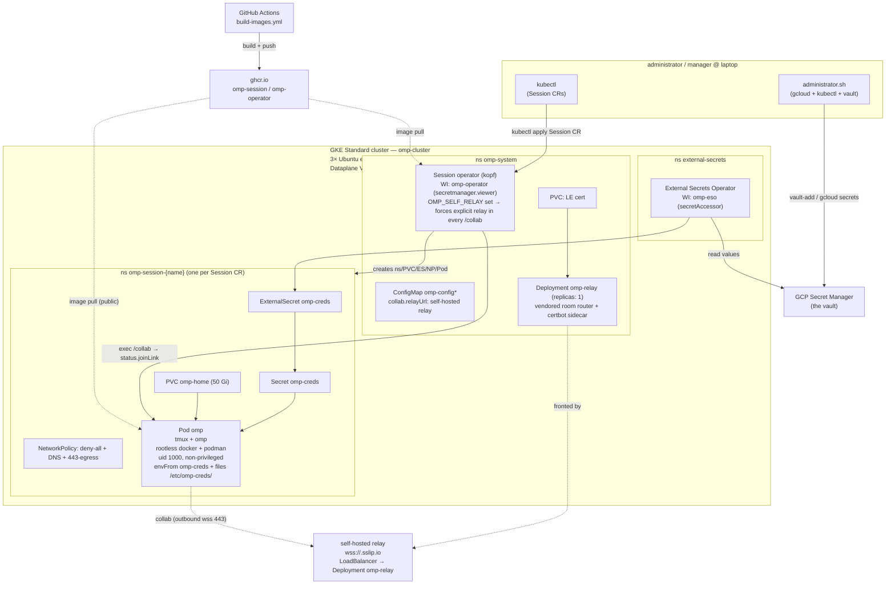
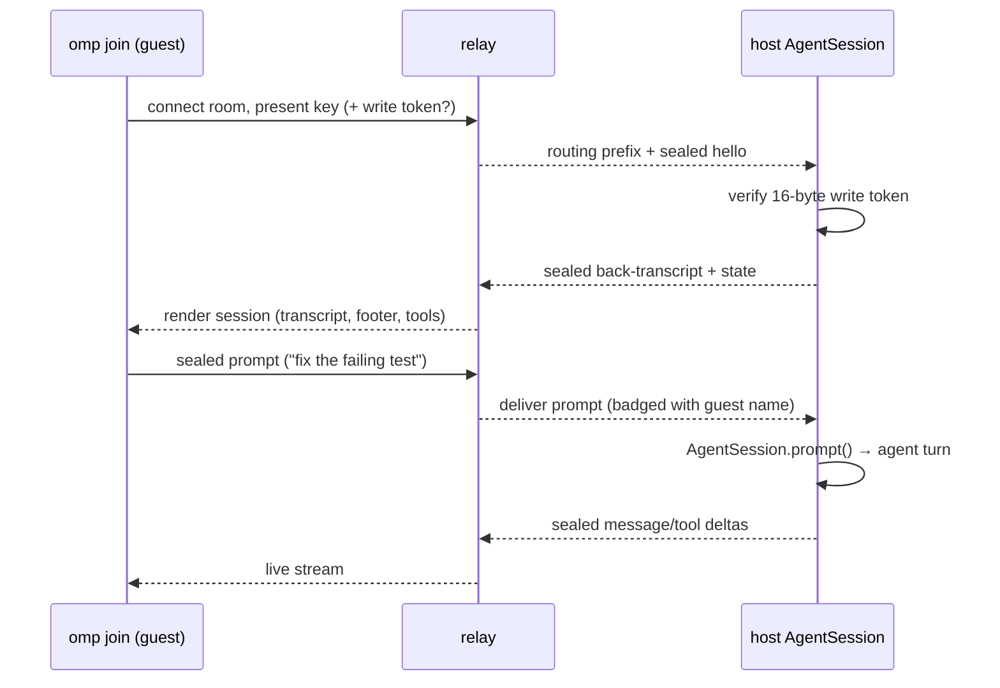
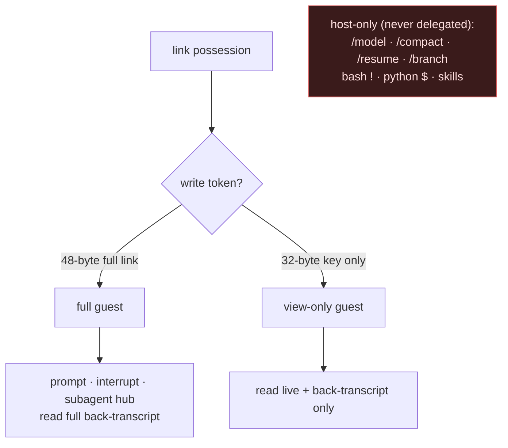
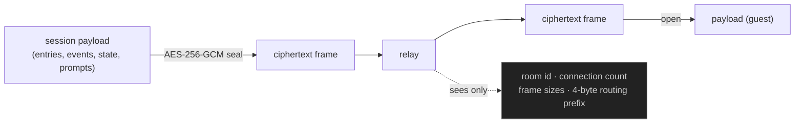
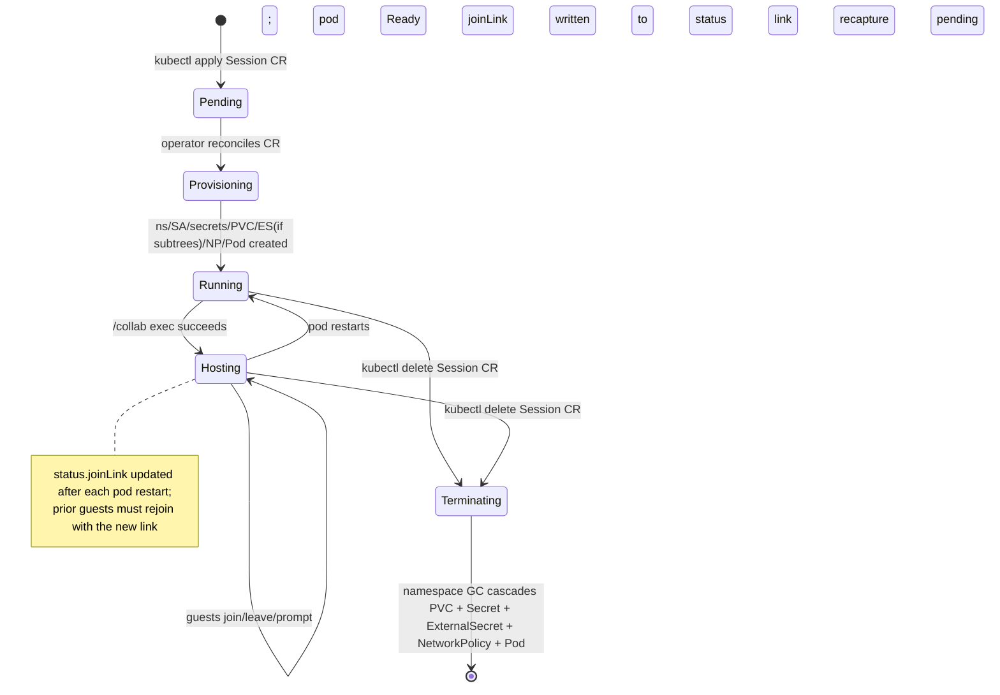

# Shared Remote Agent Machine — Architecture (GKE)

Each `omp` agent session runs as an **isolated pod in its own Kubernetes namespace**,
provisioned by a custom `Session` CRD operator on a GKE Standard cluster. Collab
traffic routes through a relay we run ourselves on the cluster (see
[docs/relay.md](relay.md)), not the public `wss://my.omp.sh`; isolation, credentials,
and lifecycle are fully Kubernetes-native.

Sources: <https://omp.sh/docs/collab>.

---

## 1. Goals / non-goals

| Goal | Mechanism |
| --- | --- |
| Per-session credential isolation (realized) | Each session namespace owns its own K8s Secret synced from GSM by ESO; no cross-namespace access |
| Many independent, simultaneously joinable sessions | One `Session` CR per session; operator provisions a pod + link per CR |
| Credentials hidden from the model | GSM → ESO → K8s Secret → pod env + global `secrets.enabled` obfuscation |
| Zero inbound ports | Session pod + guests dial relay outbound only; NetworkPolicy denies all ingress |
| Session state / OAuth tokens persist across pod restarts | PVC `omp-home` (50 Gi) per session; `$HOME` survives restart; deleted on CR delete |
| Repo, toolchain, docker/podman centralized | All tools execute inside the session pod |

Non-goals: guest-side tool execution (always pod-side), relay-side plaintext (never),
multi-tenant cluster access (single admin account).

---

## 2. Roles

| Role | Surface | Owns |
| --- | --- | --- |
| **Administrator** | `terraform` (`infra/`) + `administrator.sh` | Cluster lifecycle via Terraform (`cd infra && terraform apply` / `terraform destroy`); config / tuning via `infra/terraform.tfvars`; `administrator.sh credentials` / `status`; credential vault (`vault-add`, `vault-ls`); teams (`team-add` / `team-ls` / `team-rm`). |
| **Manager** | `administrator.sh` + `kubectl` | Session lifecycle via `kubectl` (apply/delete/exec Session CRs); vault and platform config via `administrator.sh`. |
| **Operator / joiner** | *(no script)* | Interacts only by `omp join`-ing the shared session. Behaviour governed by `RULES.md`/`AGENTS.md` and skills baked into the image. |

---

## 3. Topology

```mermaid
graph TB
  subgraph LAP["administrator / manager @ laptop"]
    ADM["administrator.sh\n(gcloud + kubectl + vault)"]
    MGR["kubectl\n(Session CRs)"]
  end
  GSM["GCP Secret Manager\n(the vault)"]
  subgraph GKE["GKE Standard cluster — omp-cluster\n3× Ubuntu e2-standard-4, europe-west1-b\nDataplane V2 + Workload Identity"]
    subgraph SYS["ns omp-system"]
      OP["Session operator (kopf)\nWI: omp-operator (secretmanager.viewer)\nOMP_SELF_RELAY set → forces explicit relay in every /collab"]
      CFG["ConfigMap omp-config*\ncollab.relayUrl: self-hosted relay"]
      RELAYDEP["Deployment omp-relay (replicas: 1)\nvendored room router + certbot sidecar"]
      RELAYPVC["PVC: LE cert"]
      RELAYPVC --> RELAYDEP
    end
    subgraph ESONS["ns external-secrets"]
      ESO["External Secrets Operator\nWI: omp-eso (secretAccessor)"]
    end
    subgraph SESS["ns omp-session-{name}  (one per Session CR)"]
      ES["ExternalSecret omp-creds"] --> SEC["Secret omp-creds"]
      PVC["PVC omp-home (50 Gi)"]
      NP["NetworkPolicy: deny-all + DNS + 443-egress"]
      POD["Pod omp\ntmux + omp\nrootless docker + podman\nuid 1000, non-privileged\nenvFrom omp-creds + files /etc/omp-creds/"]
      SEC --> POD
      PVC --> POD
    end
  end
  RELAY["self-hosted relay\nwss://<static-ip>.sslip.io\nLoadBalancer → Deployment omp-relay"]
  RELAYDEP -.->|"fronted by"| RELAY
  MGR -->|kubectl apply Session CR| OP
  OP -->|creates ns/PVC/ES/NP/Pod| SESS
  OP -->|"exec /collab → status.joinLink"| POD
  ESO -->|read values| GSM
  ESO --> ES
  ADM -->|vault-add / gcloud secrets| GSM
  POD -. "collab (outbound wss 443)" .-> RELAY
  CI["GitHub Actions\nbuild-images.yml"] -->|build + push| GHCR["ghcr.io\nomp-session / omp-operator"]
  GHCR -. "image pull (public)" .-> POD
  GHCR -. "image pull" .-> OP
```

Key property: the session pod and every guest **dial out** to the relay. No inbound
firewall rule or inbound NetworkPolicy rule is needed. Manager control rides
`kubectl exec` over the K8s API — no IAP/SSH.

---

## 4. Components

| Component | Role | Transport |
| --- | --- | --- |
| `Session` CRD (`omp.mirantis.io/v1alpha1`) | Declarative session descriptor; one CR per session. `spec` carries `subtrees`, `view`, `image`, `env` (map). Status carries `phase`, `namespace`, `podName`, `joinLink`, `viewLink`. | etcd / K8s API |
| Session operator (kopf/Python) | Reconciles `Session` CRs: creates namespace, PVC, ExternalSecret, NetworkPolicy, Pod; captures collab link via `pods/exec`; GCs namespace on CR delete. | in-cluster API + pod exec |
| External Secrets Operator (ESO) | Syncs GSM secret values into per-namespace K8s Secrets via `ClusterSecretStore omp-gsm` (Workload Identity). Refreshes hourly. | GSM API → K8s Secret API |
| GCP Secret Manager | At-rest credential store. Entries labelled `omp_vault=true`, `omp_subtree=<subtree>`. ESO's WI SA is the only accessor. | HTTPS |
| PVC `omp-home` (50 Gi, `standard-rwo`) | Persists `$HOME`: omp OAuth tokens, `~/work`, session transcripts. Survives pod restarts; deleted when the Session CR is deleted. | GKE Persistent Disk |
| `omp` pod | The agent host. Runs omp under tmux; rootless dockerd + podman (vfs driver, uid 1000, non-privileged). Platform assets baked at `/opt/omp/agent/`; seeded to `$HOME` each boot by the entrypoint. `omp-creds` is consumed via `envFrom` (omp's own model-provider keys) and mounted as files under `/etc/omp-creds/` that agent tools read. | — |
| ConfigMap `omp-config` | Master omp `config.yml` in `omp-system`; mounted read-only at `/etc/omp/config.yml` in every session pod. Rendered by the omp-platform Helm chart from `infra/terraform.tfvars` (e.g. `omp_config_memory` / `omp_config_thinking`); change it with `terraform apply`. | K8s volume mount |
| collab module (in-process) | Seals session frames (AES-256-GCM), multiplexes guests, dials the relay. Identical to prior design. | outbound wss |
| relay | Blind rendezvous. Routes opaque ciphertext; never sees plaintext. Self-hosted (Deployment `omp-relay` in `omp-system`, single replica, LoadBalancer on a reserved static IP, Let's Encrypt TLS) — the cluster-wide default via `collab.relayUrl` + operator `OMP_SELF_RELAY`, not the public `wss://my.omp.sh`. See [docs/relay.md](relay.md). | wss |
| `omp join` / web client | Guests. Render session natively; prompt/interrupt if write-capable. | wss to relay |
| GHCR images | `omp-session` + `omp-operator` published by `build-images.yml` on every relevant push. Source of truth for platform assets and operator code. | HTTPS pull |

---

## 5. Credentials

Design: **GSM → ESO → per-namespace K8s Secret → pod `envFrom`** + global
`secrets.enabled` obfuscation.

- The manager stores credentials in GCP Secret Manager. Each entry is labelled
  `omp_vault=true` and `omp_subtree=<subtree>` (`/` → `-` for label safety).
- At session creation the operator builds an `ExternalSecret` in the session namespace
  listing all secrets whose `omp_subtree` label matches a requested subtree. ESO
  (Workload Identity SA `omp-eso`, `secretmanager.secretAccessor`) syncs them into
  K8s Secret `omp-creds` in that namespace. Refresh interval: 1 h.
- The entry path maps to the env var name: strip the subtree prefix, replace `/`
  and `-` with `_`, uppercase. Examples: `shared/gemini-api-key` → `GEMINI_API_KEY`;
  `users/jn/atlassian-token` (subtree `users/jn`) → `ATLASSIAN_TOKEN`.
- The session pod consumes `omp-creds` two ways: `envFrom` for omp's own
  model-provider keys, and files under `/etc/omp-creds/` that agent tools read via
  `$(cat /etc/omp-creds/NAME)`. The operator SA (`omp-operator`,
  `secretmanager.viewer`) only reads metadata — never values.
- No pull or bootstrap Secrets are copied into session namespaces: session images are
  public on GHCR (no pull secret), and model-provider keys such as `GEMINI_API_KEY`
  come from `shared/gemini-api-key` in GSM, synced into `omp-creds` by ESO like any
  other credential.
- Global `secrets.enabled: true` (in the master ConfigMap) replaces matched env-var
  values with `#XXXX#` before any text reaches the model. `secrets.yml` carries
  value-shape regex backstops.

Trust boundary update (resolves the `planning/credential-isolation.md` Tier-2 gap):

- **M = PASS** — model receives `#XXXX#` only. Unchanged.
- **G = NAMESPACE** — Tier-2 credential isolation is **realized**: each session's
  secrets live exclusively in its own namespace's K8s Secret. A guest holding session
  A's collab link cannot reach session B's `Secret` or its pod env; NetworkPolicy
  blocks pod-to-pod lateral movement between session namespaces.
- **R = conditional FAIL** — `toolResult` blocks are persisted de-obfuscated into
  `~/work` (on the PVC). The `RULES.md` operational rule stands: never echo/print/log
  a credential; consume inline.

The GPG/`pass` vault is fully removed. No passphrase prompt. At-rest encryption is
provided by GCP Secret Manager + IAM; in-transit by ESO's WI-authenticated HTTPS and
by GKE's etcd encryption-at-rest.

---

## 6. Guest join + prompt round trip

*(Collab protocol unchanged.)*

```mermaid
sequenceDiagram
  participant G as omp join (guest)
  participant Y as relay
  participant H as host AgentSession

  G->>Y: connect room, present key (+ write token?)
  Y-->>H: routing prefix + sealed hello
  H->>H: verify 16-byte write token
  H-->>Y: sealed back-transcript + state
  Y-->>G: render session (transcript, footer, tools)

  G->>Y: sealed prompt ("fix the failing test")
  Y-->>H: deliver prompt (badged with guest name)
  H->>H: AgentSession.prompt() → agent turn
  H-->>Y: sealed message/tool deltas
  Y-->>G: live stream
```

Names are display-only; the LLM sees prompt text verbatim. A guest's `Esc` interrupt
rides the same sealed channel and maps to the host's abort path.

---

## 7. Trust & permission layering

```mermaid
graph TD
  L["link possession"] --> F{write token?}
  F -- "48-byte full link" --> FULL["full guest"]
  F -- "32-byte key only" --> VIEW["view-only guest"]

  FULL --> CAN["prompt · interrupt · subagent hub\nread full back-transcript"]
  VIEW --> RO["read live + back-transcript only"]

  HOSTONLY["host-only (never delegated):\n/model · /compact · /resume · /branch\nbash ! · python $ · skills"]

  classDef ho fill:#3a1b1b,stroke:#d65b5b,color:#ffe0e0;
  class HOSTONLY ho;
```

Enforcement is by the link itself (host verifies write token at join). Guests keep a
small local allowlist (`/dump`, `/export`, `/copy`, `/help`, `/hotkeys`, `/theme`,
`/settings`, `/leave`, `/collab`, `/exit`).

Namespace-level enforcement (new): the session pod runs as uid 1000 with no cluster
permissions. Even a shell-escape inside the pod cannot reach sibling namespaces — the
session ServiceAccount holds no cross-namespace RBAC; NetworkPolicy blocks
pod-to-pod traffic between session namespaces.

---

## 8. Encryption & what the relay sees

*(Identical to prior design.)*

```mermaid
graph LR
  PT["session payload\n(entries, events, state, prompts)"] -->|"AES-256-GCM seal"| CT["ciphertext frame"]
  CT --> RELAY["relay"]
  RELAY --> CT2["ciphertext frame"]
  CT2 -->|"open"| PT2["payload (guest)"]

  RELAY -.sees only.-> META["room id · connection count\nframe sizes · 4-byte routing prefix"]
  classDef m fill:#222,stroke:#888,color:#ccc;
  class META m;
```

The key lives in the URL fragment (`#<key>`), never sent in any HTTP request, never
reaching the relay. Link possession is the entire trust boundary — treat full and
view-only links as secrets.

---

## 9. Network & auth matrix

| Path | Direction | Port/Proto | Auth |
| --- | --- | --- | --- |
| manager → K8s API | outbound from laptop | 443 HTTPS | Google IAM (`roles/container.admin`) |
| manager → GSM | outbound from laptop | 443 HTTPS | Google IAM (admin account) |
| session pod → relay | outbound from pod | 443 wss | room key (E2E); relay blind |
| guest → relay | outbound from guest | 443 wss | link (key ± write token) |
| browser → relay | outbound | 443 https + wss | link in fragment |
| ESO → GSM | outbound from cluster | 443 HTTPS | Workload Identity (`omp-eso`, `secretAccessor`) |
| operator → K8s API | in-cluster | 443 HTTPS | ServiceAccount RBAC (`omp-operator` ClusterRole) |
| operator → pod exec | in-cluster | via K8s API (`pods/exec`) | ServiceAccount RBAC |

NetworkPolicy per session namespace: **deny-all ingress; deny-all egress except**
UDP/TCP 53 to `kube-system` (DNS) and TCP 443 to `0.0.0.0/0` **excluding**
`10.0.0.0/8`, `172.16.0.0/12`, `192.168.0.0/16`, `169.254.169.254/32`.
The exclusions block RFC1918 lateral movement to other session namespaces and,
critically, the GCE metadata server — a compromised pod cannot mint Workload Identity
tokens or reach GSM directly. The operator's `pods/exec` rides the API server, not
pod networking, so it is unaffected by the policy.

No inbound ports on any session pod. No IAP/SSH path.

---

## 10. Session lifecycle

```mermaid
stateDiagram-v2
  [*] --> Pending: kubectl apply Session CR
  Pending --> Provisioning: operator reconciles CR
  Provisioning --> Running: ns/SA/secrets/PVC/ES(if subtrees)/NP/Pod created; pod Ready
  Running --> Hosting: /collab exec succeeds; joinLink written to status
  Hosting --> Hosting: guests join/leave/prompt
  Hosting --> Running: pod restarts; link recapture pending
  Running --> Terminating: kubectl delete Session CR
  Hosting --> Terminating: kubectl delete Session CR
  Terminating --> [*]: namespace GC cascades PVC + Secret + ExternalSecret + NetworkPolicy + Pod
  note right of Hosting
    status.joinLink updated after each pod restart;
    prior guests must rejoin with the new link
  end note
```

A pod restart (crash / OOM / manual delete) keeps the Session CR alive. The operator
re-captures the collab link from the restarted pod and updates `status.joinLink`;
phase drops to `Running` during recapture and returns to `Hosting` once the link is
refreshed. The PVC persists `$HOME` (auth tokens, `~/work`) across restarts.
Deleting the CR (`kubectl delete session NAME -n <namespace>`) fully reclaims all resources including the disk.

During provisioning the operator builds a per-session `omp-creds` `ExternalSecret` from the requested `spec.subtrees`; creation is skipped when `spec.subtrees` is empty (ESO rejects empty data). No pull or bootstrap Secrets are copied — session images are public and model keys arrive through the vault like any other credential.

---

## 11. Failure modes

| Failure | Detection | Recovery |
| --- | --- | --- |
| relay unreachable (client-side) | collab connect error event, or `TLS handshake failed` | retry with backoff; link stable across retries. See [docs/relay.md](relay.md) troubleshooting — often network-level interception of the relay hostname on the joining machine, not a relay fault |
| relay pod down | `kubectl get pod -n omp-system -l app=omp-relay` not `2/2 Running`; `/healthz` non-200 | Deployment auto-restarts it; **never scale beyond 1 replica** (rooms are in-memory); active rooms drop on restart, guests must rejoin |
| pod crash / OOM | K8s `restartPolicy: Always` | automatic restart; operator re-captures collab link; guests rejoin with new link |
| operator crash | K8s Deployment restarts it | on resume, kopf `@kopf.on.resume` re-reconciles all existing Session CRs |
| ESO sync failure | `ExternalSecret` status `SecretSyncError` | ESO retries; check GSM IAM or secret existence; `kubectl get externalsecret omp-creds -n omp-session-<name>`. Note: only applies when `spec.subtrees` is non-empty — empty subtrees skip ExternalSecret creation entirely. |
| stale collab link after pod restart | `status.phase` = `Running` during recapture | annotate the Session CR (`kubectl annotate session NAME -n <namespace> omp.mirantis.io/recapture=$(date +%s) --overwrite`); wait for `Hosting` |
| guest write without token | host token verify fails | guest downgraded to read-only; no server-side change needed |
| credential printed by a tool | value lands in `~/work/*.jsonl` and on guest screens | `RULES.md` forbids printing; rotate the leaked entry in GSM |
| node failure | GKE node controller evicts pod; rescheduled | PVC re-attaches on new node within the same zone (zonal `standard-rwo` disk) |

---

## 12. Operator surface

| Command | Action |
| --- | --- |
| `cd infra && terraform apply` | provision everything at once: GKE cluster, GCP SAs (`omp-eso`, `omp-operator`), IAM bindings, API enablement, ESO, Session CRD + RBAC, operator Deployment, `ClusterSecretStore omp-gsm`, and the master `omp-config` ConfigMap (all rendered by the omp-platform Helm chart) |
| `cd infra && terraform destroy` | tear down the cluster and all GCP resources |
| edit `infra/terraform.tfvars` + `terraform apply` | config / tuning (e.g. `omp_config_memory`, `omp_config_thinking`); the Helm chart re-renders `omp-config`; running pods pick up on next restart |
| `administrator.sh credentials` | `gcloud container clusters get-credentials` (thin convenience) |
| `administrator.sh status` | cluster describe + `kubectl get nodes` + `kubectl get sessions -A` |
| `administrator.sh vault-add ENTRY` | insert credential into GSM (value on stdin, never echoed) |
| `administrator.sh vault-ls [SUBTREE]` | list GSM secret names for the vault (names only, never values) |
| `kubectl apply` (Session CR in any namespace the operator watches; `omp-system` is conventional but any namespace works) | create Session CR; operator provisions namespace + PVC + pod; wait for `status.phase=Hosting` |
| `kubectl exec -it -n omp-session-NAME omp -- bash -lc 'omp auth login'` | in-pod OAuth for interactive model auth; token persists on PVC |
| `kubectl get session NAME -n <namespace> -o jsonpath='{.status.joinLink}'` | print join link from Session CR status (use `status.viewLink` for read-only) |
| `kubectl exec -it -n omp-session-NAME omp -- tmux attach -t omp` | attach to session tmux |
| `kubectl get sessions -A` | list all Session CRs (operator watches cluster-wide; use `-A` to find them in any namespace) |
| `kubectl delete session NAME -n <namespace>` | delete Session CR → GC namespace + PVC |
| `omp join "<link>"` | from any user machine |

---

## 13. Why this shape

- **Per-session namespace isolation**: Tier-2 OS isolation is now realized via GKE
  namespaces — each session's credentials live exclusively in its own namespace's
  K8s Secret (ESO-synced from GSM), its pod runs as uid 1000 with no cross-namespace
  RBAC, and a deny-all NetworkPolicy blocks lateral movement. G exposure (guests see
  real values in their own collab session) remains bounded by link possession, but
  cross-session credential leakage is eliminated.
- **Session operator + CRD over SSH scripting**: the manager applies a CR and walks
  away; the operator reconciles asynchronously, captures the link, and writes
  structured status back. No long-lived SSH connection, no race between launcher and
  tmux, no shared OS user.
- **GSM + ESO over pass/GPG**: a managed, IAM-governed secret store with no GPG key
  management, no per-session launcher generation, and a clean audit trail. ESO syncs
  values into scoped K8s Secrets rather than decrypting into a shared process
  environment.
- **PVC per session**: OAuth tokens and workspace state persist across pod restarts
  without manual re-auth; disk lifecycle is tied to the Session CR, so `kill` is a
  clean teardown with no orphaned data.
- **collab for users, not SSH-shared tmux**: guests get a native rendered session
  (tool cards, subagent hub, footer state) and per-link permissions, not a raw
  mirrored terminal; works from a browser with nothing installed. Unchanged from the
  prior design.
- **Relay dial-out from pod, self-hosted**: NetworkPolicy allows only outbound 443
  (non-RFC1918, non-metadata) — no inbound exposure; the relay is a blind ciphertext
  router we run ourselves (not the public `wss://my.omp.sh`), so availability isn't
  dependent on third-party infrastructure; trust boundary still collapses to link
  possession. See [docs/relay.md](relay.md).
- **GHCR images + CI**: platform assets (rules, commands, skills, config defaults) are
  baked into the (public) image and updated by pushing a branch — no SSH file-upload,
  no per-VM bootstrap script. The cluster is fully reproducible from `cd infra &&
  terraform apply`.

---

## 14. Platform redesign — Options A, B, C

Design review of the platform's structural weaknesses (W1–W8) and three composable
remediation options. See plan for full rationale and migration order.

### Option A — Declarative platform: Terraform + Helm + `ompctl`

**Targets:** W1 (stringly-typed bash tooling), W7 (manual image/tag ops), W8 (imperative GCP layer).

- **GCP layer → `infra/`** (Terraform module): cluster, node pool, GCP SAs, WI bindings,
  IAM, API enablement. `terraform apply` / `terraform destroy` are the single
  provisioning / teardown path — real state, with partial failures visible in plan diffs.
- **Cluster layer → `charts/omp-platform/`** (Helm chart): Session CRD, operator
  Deployment + RBAC, VAP, ClusterSecretStore, master ConfigMap, team namespaces.
  All `envsubst` variables become `values.schema.json`-validated `values.yaml` keys —
  typos fail loudly instead of applying garbage.
- **Terraform drives the chart** via `hashicorp/helm` provider (no separate `helm`
  invocation by the admin). Cluster config and tuning become tfvars keys; `terraform
  apply` is the single end-to-end operation from empty project to serving platform.
- **Imperative residue → `ompctl`**: vault add/ls, cred add/ls, session
  stop/start/restart/link, auth, port-forward. Secrets stay Python variables end-to-end —
  the F3/F4 bash-heredoc injection bug class is structurally impossible.
- `administrator.sh` (1,269 lines), `lib/common.sh`, and all `envsubst` rendering are
  deleted after adoption.

### Option B — GSM-only credentials: ESO everywhere, zero copies

**Targets:** W2 (dual credential systems), W3 (copy-based drift), root cause of F1/F2/F8.

- `spec.credentialSecrets` (per-user K8s Secret copy machinery) is removed; `spec.subtrees`
  is canonical. Personal credentials live in GSM under `users/<name>/` and are requested
  via `subtrees: ["users/<name>"]`.
- Self-service: users add credentials via `ompctl cred add <key>` — writes to
  `users/<you>/<key>` in GSM; ESO distributes to `omp-creds` hourly with no reconcile
  trigger. Rotation propagates automatically within ≤1 h.
- VAP expression updated: `spec.subtrees` validated — users may only request their own
  `users/<name>` subtree.
- Per-user namespaces (`omp-user-<name>`), `_copy_secret`, 5 CLI commands, and the
  operator's cluster-wide `secrets get/create/update/patch/delete` RBAC are deleted.
- The bootstrap model-API-key Secret is replaced by `shared/gemini-api-key` in GSM —
  a platform credential, exactly what `shared/` is for.
- Session images are public on GHCR; the interim pull-secret fan-out and PAT
  dependency are removed (nodes pull anonymously, no image pull secret in the pod spec).

### Option C — StatefulSet sessions + deterministic link publication

**Targets:** W4 (bare-pod node failure), W5 (tmux scraping), W6 (imperative reconcile).

- **Session Pod → StatefulSet** (`replicas=1`, named `omp` per session namespace).
  Pod name: **`omp-0`**. Node failure auto-reschedules (fixes the W4 availability hole —
  the §11 failure table entry "node failure → rescheduled" is now accurate for StatefulSets).
  `spec.state: stopped` maps to `replicas: 0`; PVC is untouched.
- **Join link → file, not tmux scrape.** omp writes
  `~/.omp/collab-link.json` (`{"joinLink":"…","viewLink":"…","capturedAt":"…"}`) on
  hosting start. The operator reads it with a single `exec cat` (retry-until-exists),
  replacing the `send-keys` / `sleep 8` / `capture-pane` / grep sequence.
  The recapture-annotation protocol disappears from the manager workflow.
- **Server-side apply** for all child resources (kopf + `field_manager="omp-operator",
  force=True`): upsert semantics are the default; `_create_or_skip` and hand-written
  upsert code (F8 fix) are deleted.
- Rename impact: manager skill exec commands and `port-forward` pod lookups use `omp-0`
  instead of `omp`.
