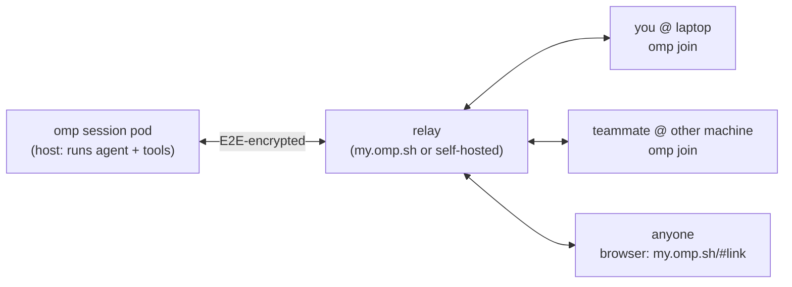

# Shared Sessions on the Remote Agent Machine

Analysis of oh-my-pi collab for sharing the GCP omp-agent VM across users
and machines.

Sources: <https://omp.sh/docs/collab>, `omp join --help`.

## TL;DR

`/collab` is the right mechanism for shared sessions across users/machines.
The GCP VM is the ideal **host**: it runs the agent, the repo, the toolchain,
and docker/podman; guests attach to the live session from any machine (native
TUI) or a browser (no install).

## How `/collab` works

`/collab` shares a **running** omp session. The host machine runs the agent and
all tools; guests render the same session natively in their own TUI — streaming
assistant text, tool-call cards, footer state (cwd, model, context %, cost),
ctrl+o expansion, `/dump`. No terminal mirroring. Guests can prompt and
interrupt the agent; the host executes everything.



### Commands

| Command | Effect |
| --- | --- |
| `/collab` | Start sharing (or re-print the link when already hosting) |
| `/collab <relay>` | Start sharing through a specific relay (`relay.example.com`, `ws://localhost:7475`) |
| `/collab view` | Print a read-only (view-only) link (starts sharing first if needed) |
| `/collab status` | Show link + participants |
| `/collab stop` | Stop sharing |
| `/join <link>` | Join a shared session as a guest |
| `/leave` | Leave (guest) or stop sharing (host) |

`omp join "<link>"` is the CLI equivalent of `/join` from a fresh terminal.

### Example

On the VM, inside the running omp session:

```
/collab
```

prints

```
Collab session started!
 • Join from another terminal: omp join "mgAYTZwEnpRQtca0CTgn-Q#gdJUbTovD94ofDaa8YvhY0-ty16w4fn8PgB6PLnoA30"
 • or any web browser: my.omp.sh/#mgAYTZwEnpRQtca0CTgn-Q#gdJUbTovD94ofDaa8YvhY0-ty16w4fn8PgB6PLnoA30
```

Guests, from anywhere:

```
omp join "mgAYTZwEnpRQtca0CTgn-Q#gdJU…"     # native TUI
# or open the my.omp.sh/#… URL in a browser — no omp install needed
```

The guest's previous session is restored on `/leave` (or when the host stops).

## Link format

```
https://host[:port]/#<link>          → browser deep link (printed by /collab; /join accepts it too)
<roomId>#<key>                       → default relay (my.omp.sh)
host[:port]/r/<roomId>#<key>         → custom relay, wss:// inferred
ws://localhost:7475/r/<roomId>#<key> → plain ws, allowed for localhost only
```

The trailing `#<key>` fragment is the room secret, base64url-encoded:

- **Full link** — 48 bytes: 32-byte AES-256-GCM room key + 16-byte write token.
  Grants prompting, interrupting, subagent control.
- **View-only link** — bare 32-byte key, no write token. Live read access only.

In the browser deep link, everything after the first `#` (room id + key) is a
URL fragment: it never appears in any HTTP request, and neither secret reaches
the relay.

## Security model

Every session payload (entries, events, state, prompts) is sealed with
AES-256-GCM before it touches the socket. The relay sees only:

- room ids and connection counts,
- opaque ciphertext frames and their sizes,
- a 4-byte routing prefix (which guest a frame targets).

**Possession of the link is the trust boundary.** A full link reads and steers
the session; a view-only link reads it. Share both like secrets.

### Guest permission model

Two trust levels, enforced by the link itself (host verifies the 16-byte write
token at join and rejects writes from peers without it).

Full-link guests can:

- read the entire session, including the back-transcript at join time,
- prompt the agent (rendered with their name badge; the LLM sees prompt text
  verbatim, names are display-only),
- interrupt the agent (Esc),
- use the Agent Hub against the host's subagents (live table/progress, chat,
  kill, revive, transcript viewing).

View-only guests can read everything live but cannot prompt, interrupt, or
control agents.

**Host-only (never delegated to guests):** `/model`, `/compact`, `/resume`,
`/branch`, bash (`!`), python (`$`), skills. Guests keep a small local
allowlist: `/dump`, `/export`, `/copy`, `/help`, `/hotkeys`, `/theme`,
`/settings`, `/leave`, `/collab`, `/exit`.

Known v1 limit: a turn already streaming when a guest joins becomes visible
from its next message boundary.

## Browser client

The relay serves a standalone browser client at `/` for the same links — no omp
install on the guest side. `https://<relay>/#<link>` loads it and auto-connects
from the fragment: live transcript (streaming text, thinking, tool cards),
subagent panel with on-demand transcripts, and a composer with the same guest
powers (prompt, interrupt, hub actions). The client only ever talks to the
relay; the key stays in the fragment.

## Settings

| Setting | Default | Meaning |
| --- | --- | --- |
| `collab.relayUrl` | `wss://my.omp.sh` | Relay used by `/collab` when no relay is passed inline |
| `collab.displayName` | OS username | Name shown to other participants |

## Recommended setup

1. Launch the session: apply a Session CR in omp-system (see the [manager guide](../roles/manager.md)).
2. Share it: `kubectl get session work -n omp-system -o jsonpath='{.status.joinLink}'` (or `status.viewLink` for read-only) prints the `omp join "<link>"` line.
3. Hand the printed `omp join "<link>"` or `my.omp.sh/#<link>` URL to operators; attach yourself with `kubectl exec -it -n omp-session-work omp -- tmux attach -t omp`.
4. Benefits that fit the original goal:
   - Agent, repo, toolchain, docker/podman all live on the always-on session pod.
   - The session survives your laptop sleeping; collab lets others attach to the
     agent session (not just a mirrored terminal).
   - Guests need nothing installed (browser client) — just the link.

### Relay choice

Default relay `wss://my.omp.sh` is third-party but E2E-encrypted (sees only
ciphertext, room ids, connection counts; the key never leaves the URL
fragment). Acceptable to start with. To avoid the dependency entirely,
`/collab <relay>` accepts a custom relay — the same VM could host one.

## Collab link retrieval

`kubectl get session NAME -n omp-system -o jsonpath='{.status.joinLink}'` reads the
link from the Session CR status. The operator captures it via `pods/exec` after the
pod starts, so no SSH or tmux steering is needed.
